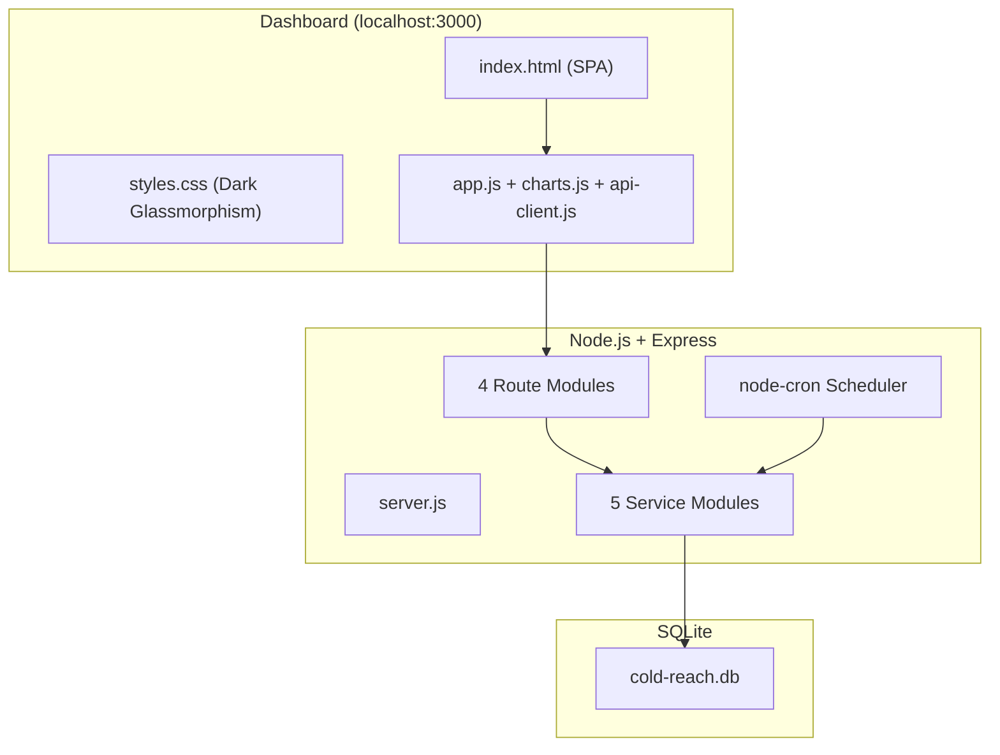

# Cold Reach Automation — Walkthrough

## What Was Built

A full-stack cold outreach automation system for internship applications at AI/ML and SDE startups in the US and India.

### Architecture



---

## Files Created (22 files)

### Project Root
| File | Purpose |
|------|---------|
| [server.js](file:///d:/downloads/cold-reach-automation/server.js) | Express entry point, mounts routes, starts scheduler |
| [package.json](file:///d:/downloads/cold-reach-automation/package.json) | Dependencies and scripts |
| [.env.example](file:///d:/downloads/cold-reach-automation/.env.example) | Template for environment variables |
| [.gitignore](file:///d:/downloads/cold-reach-automation/.gitignore) | Ignores node_modules, .env, DB, resume |

### Config & Database
| File | Purpose |
|------|---------|
| [config/settings.js](file:///d:/downloads/cold-reach-automation/config/settings.js) | Central configuration from environment variables |
| [database/init.js](file:///d:/downloads/cold-reach-automation/database/init.js) | SQLite schema: leads, outreach_log, app_settings |

### Services (Business Logic)
| File | Purpose |
|------|---------|
| [services/email-service.js](file:///d:/downloads/cold-reach-automation/services/email-service.js) | Gmail SMTP via Nodemailer, tracking injection, rate limiting |
| [services/lead-service.js](file:///d:/downloads/cold-reach-automation/services/lead-service.js) | Lead CRUD, CSV import, priority scoring |
| [services/outreach-service.js](file:///d:/downloads/cold-reach-automation/services/outreach-service.js) | Batch sending, follow-ups, dashboard stats, cron scheduling |
| [services/tracker-service.js](file:///d:/downloads/cold-reach-automation/services/tracker-service.js) | Email open/click tracking |
| [services/linkedin-service.js](file:///d:/downloads/cold-reach-automation/services/linkedin-service.js) | LinkedIn message template generation |
| [services/scraper-service.js](file:///d:/downloads/cold-reach-automation/services/scraper-service.js) | Apify integration for automated LinkedIn profile scraping |

### API Routes
| File | Purpose |
|------|---------|
| [routes/api-leads.js](file:///d:/downloads/cold-reach-automation/routes/api-leads.js) | Lead CRUD, CSV import, priority retrieval |
| [routes/api-outreach.js](file:///d:/downloads/cold-reach-automation/routes/api-outreach.js) | Send emails, batch send, LinkedIn gen, status updates |
| [routes/api-dashboard.js](file:///d:/downloads/cold-reach-automation/routes/api-dashboard.js) | Stats, activity feed, settings |
| [routes/api-tracker.js](file:///d:/downloads/cold-reach-automation/routes/api-tracker.js) | Open pixel, click redirect |
| [routes/api-scraper.js](file:///d:/downloads/cold-reach-automation/routes/api-scraper.js) | Trigger and monitor Apify scraping jobs |

### Email Templates
| File | Purpose |
|------|---------|
| [templates/cold-email-founder.html](file:///d:/downloads/cold-reach-automation/templates/cold-email-founder.html) | Personalized cold email for founders |
| [templates/cold-email-recruiter.html](file:///d:/downloads/cold-reach-automation/templates/cold-email-recruiter.html) | Professional email for recruiters/HR |

### Seed Data
| File | Purpose |
|------|---------|
| [data/seed-leads.csv](file:///d:/downloads/cold-reach-automation/data/seed-leads.csv) | 50 startup contacts (32 AI/ML, 18 SDE; 30 US, 20 India) |

### Frontend Dashboard
| File | Purpose |
|------|---------|
| [public/index.html](file:///d:/downloads/cold-reach-automation/public/index.html) | SPA with 7 pages, 3 modals |
| [public/css/styles.css](file:///d:/downloads/cold-reach-automation/public/css/styles.css) | Dark glassmorphism design system (~700 lines) |
| [public/js/app.js](file:///d:/downloads/cold-reach-automation/public/js/app.js) | All frontend logic (~500 lines) |
| [public/js/charts.js](file:///d:/downloads/cold-reach-automation/public/js/charts.js) | Chart.js rendering for analytics |
| [public/js/api-client.js](file:///d:/downloads/cold-reach-automation/public/js/api-client.js) | Fetch API wrapper |

---

## What Was Tested

| Test | Result |
|------|--------|
| Database initialization | ✅ Schema created with 3 tables, 8 indexes |
| Server startup | ✅ Running on localhost:3000 |
| CSV import via API | ✅ 50 leads imported with correct priority scores |
| Dashboard stats API | ✅ Returns all stats, pipeline, domain/region breakdowns |
| Email dry-run send | ✅ Personalized subject, logged to outreach_log |
| LinkedIn message generation | ✅ Personalized, under 300 char limit |
| Activity feed API | ✅ Shows outreach history |
| Lead CRUD operations | ✅ Create, read, update, filter working |

---

## How to Use

### 1. Initial Setup
```bash
cd d:\downloads\cold-reach-automation

# Copy and edit environment file
cp .env.example .env
# Edit .env with your Gmail, App Password, name, and intro

# Start the server
npm run dev
```

### 2. Configure Gmail
1. Enable 2FA on your Google account
2. Go to [Google App Passwords](https://myaccount.google.com/apppasswords)
3. Generate a new app password for "Nodemailer"
4. Paste the 16-char password into `.env` as `GMAIL_APP_PASSWORD`

### 3. Add Your Resume
Place your resume PDF at:
```
d:\downloads\cold-reach-automation\assets\resume.pdf
```

### 4. Lead Generation & Scraping
1. Click **🤖 Auto Scrape** to start finding LinkedIn profiles based on your search query.
2. The apify scraper will automatically search Google for targeted LinkedIn profiles.
3. Once leads are scraped, you can now click **🔍 Find Missing Emails**. This uses the Apollo.io API to automatically discover their verified work email addresses based on their name and company.

### 5. Outreach Pipeline
1. Go to **Settings** → Disable **Dry Run Mode** when ready.
2. Go to **Compose** → Send individual emails or use **Batch Send**.
3. Add your `APIFY_API_TOKEN` to the `.env` file.
4. Restart the server.
5. Go to the **Leads** page and click **🤖 Auto Scrape**.
6. Enter your search query (e.g., `site:linkedin.com/in/ "founder" "AI"`) and max results.
7. Click **Start Scraping**. The server will run a background job on Apify, parse the Google search results for LinkedIn profiles, extract roles/domains heuristically, and automatically insert new leads into your pipeline!

### 6. LinkedIn Outreach
1. Go to **Compose** → LinkedIn Message tab
2. Select a lead and template
3. Click **Generate Message** → **Copy to Clipboard**
4. Open the lead's LinkedIn profile → paste the message
5. Click **Mark as Sent** to log it in your dashboard

---

## Key Design Decisions

- **Dry-run mode on by default** — No accidental emails sent before configuration
- **Rate limiting** — 20 emails/day, 2-minute gaps between sends to protect deliverability
- **Priority scoring** — Smaller companies automatically ranked higher (10 for <10 employees)
- **LinkedIn = manual send** — Avoided risky LinkedIn automation that could get your account banned
- **Email tracking** — Open pixels and click redirects for analytics (works when server is accessible)
- **Follow-up automation** — Auto-schedules follow-ups at Day 3 and Day 7
